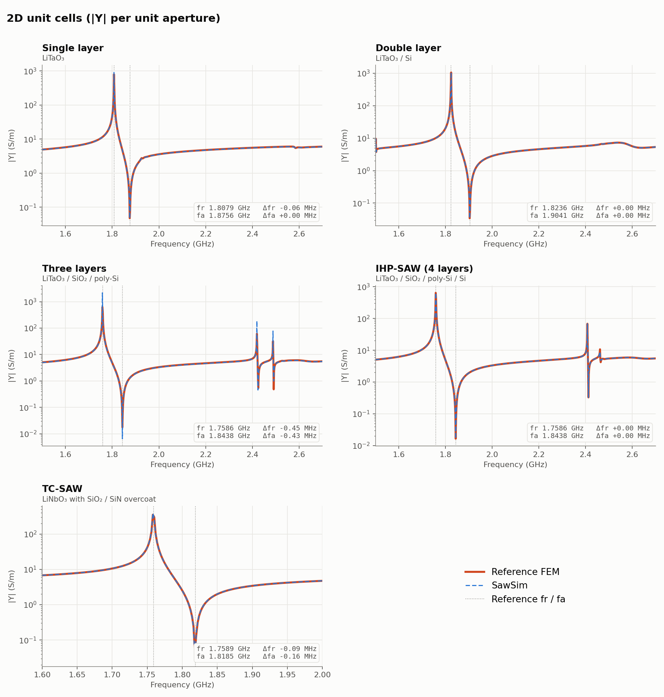
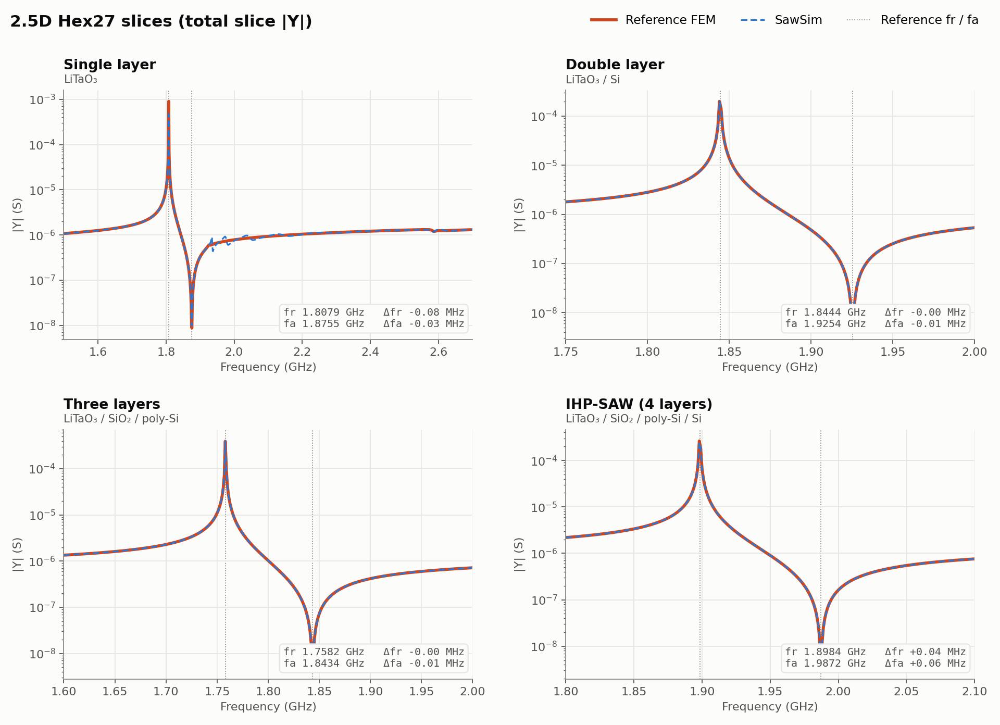

[中文](validation.md) · **English**

# Validation

Each template is compared with an independent reference FEM solution on the same frequencies. The reference was computed
with commercial FEM software for the same geometry, materials and boundaries; the exported data contain frequency and |Y11|
only (2026-09-11). **Accuracy is measured by the resonance fr and the anti-resonance fa**, extracted from both curves with
the same method (`sawsim.metrics`: fr = |Y| peak, fa = the following minimum, refined between samples by a V-fit).

| template | points | step MHz | reference fr / fa (GHz) | sawsim fr / fa (GHz) | Δfr / Δfa (MHz) |
|---|---:|---:|---|---|---|
| `sp_single_layer` | 801 | 1.5 | 1.80791 / 1.87557 | 1.80785 / 1.87557 | −0.06 / 0.00 |
| `sp_double_layer` | 801 | 1.5 | 1.82362 / 1.90406 | 1.82363 / 1.90407 | 0.00 / 0.00 |
| `sp_triple_layer` | 801 | 1.5 | 1.75860 / 1.84384 | 1.75815 / 1.84340 | −0.45 / −0.43 |
| `sp_quad_layer` | 801 | 1.5 | 1.75859 / 1.84382 | 1.75859 / 1.84382 | 0.00 / 0.00 |
| `sp_tcsaw` | 201 | 2.0 | 1.75891 / 1.81852 | 1.75882 / 1.81836 | −0.09 / −0.16 |
| `sp_2p5d_single_layer` | 1201 | 1.0 | 1.80791 / 1.87554 | 1.80783 / 1.87552 | −0.08 / −0.03 |
| `sp_2p5d_double_layer` | 251 | 1.0 | 1.84441 / 1.92538 | 1.84441 / 1.92537 | 0.00 / −0.01 |
| `sp_2p5d_triple_layer` | 401 | 1.0 | 1.75820 / 1.84342 | 1.75820 / 1.84342 | 0.00 / −0.01 |
| `sp_2p5d_quad_layer` | 301 | 1.0 | 1.89841 / 1.98725 | 1.89844 / 1.98731 | +0.04 / +0.06 |

fr and fa of all nine templates agree with the reference within 0.5 MHz, mostly below 0.1 MHz, and always below the
frequency step.

The 2.5D single-layer curve shows a small ripple between 1.93 and 2.2 GHz where the reference is smooth; fr and fa are not affected. Both figures are generated from `tests/data/` by `python docs/figures/make_validation_figures.py`.

Peak and valley |Y| amplitudes are not used as an accuracy measure: the validation runs are lossless, the resonance and
anti-resonance are a pole and a zero, the amplitude at a sample depends on how close it falls to the pole, and the frequency
step is much coarser than the linewidth. Comparing peak/valley amplitudes or Q needs the same loss on both sides and a step
finer than the linewidth (see [Driving SawSim with AI agents](ai-agents.en.md)). The 2.5D templates compare the total slice
admittance (S), not normalised by the aperture.

## How the tests reproduce this

- `tests/test_agent.py`: for every template, fr/fa are extracted from the reference and the released curve in `tests/data/`
  and must agree within 1 MHz.
- `tests/test_templates.py`: runs the solver at 5 – 6 frequencies and compares with this solver's released curve (relative
  difference ≤ 2 × 10⁻³; PARDISO and SuperLU differ by about 10⁻⁴) and checks that the deviation from the reference does
  not exceed the level measured at release, to catch numerical regressions.

The npz files in `tests/data/` contain the full frequency grid, the released curve and the reference curve for your own plots
or finer comparisons.

## Comparing with other software

- Use the same material tensors, reference axes and Euler convention (see [Materials and orientation](materials-and-orientation.en.md)); check the rotated tensors in `material_snapshot.json` first.
- 2D results are admittance per unit aperture (S/m); for 2.5D compare total admittance via `raw_admittance_s` in `admittance.npz`.
- PML material, thickness and frequency-dependent parameters of the reference model must match; this project uses the last sweep frequency as the PML reference frequency.
