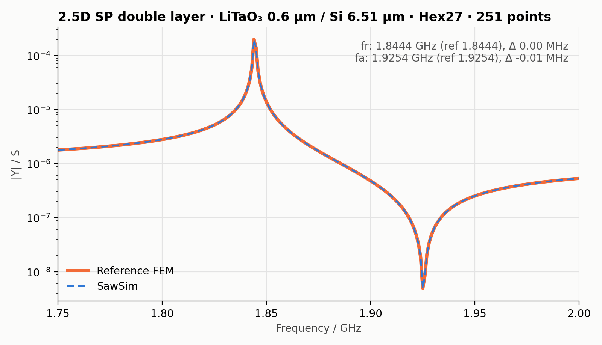
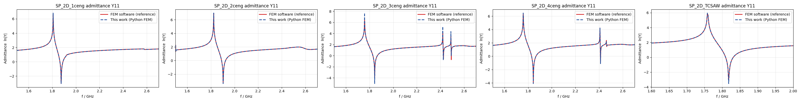

**中文** · [English](validation.en.md)

# 验证

每个模板与一个独立的参考有限元解在相同频点上比较。参考解来自商业有限元软件对同一几何、材料与边界设置的计算，
导出数据只含频率与 |Y11|（2026-09-11）。**精度以谐振频率 fr 与反谐振频率 fa 衡量**：两条曲线用同一方法提取
（`sawsim.metrics`：fr 取 |Y| 峰，fa 取其后的谷，采样点之间做 V 形细化）。

| 模板 | 频点 | 步长 MHz | 参考 fr / fa (GHz) | sawsim fr / fa (GHz) | Δfr / Δfa (MHz) |
|---|---:|---:|---|---|---|
| `sp_single_layer` | 801 | 1.5 | 1.80791 / 1.87557 | 1.80785 / 1.87557 | −0.06 / 0.00 |
| `sp_double_layer` | 801 | 1.5 | 1.82362 / 1.90406 | 1.82363 / 1.90407 | 0.00 / 0.00 |
| `sp_triple_layer` | 801 | 1.5 | 1.75860 / 1.84384 | 1.75815 / 1.84340 | −0.45 / −0.43 |
| `sp_quad_layer` | 801 | 1.5 | 1.75859 / 1.84382 | 1.75859 / 1.84382 | 0.00 / 0.00 |
| `sp_tcsaw` | 201 | 2.0 | 1.75891 / 1.81852 | 1.75882 / 1.81836 | −0.09 / −0.16 |
| `sp_2p5d_single_layer` | 1201 | 1.0 | 1.80791 / 1.87554 | 1.80783 / 1.87552 | −0.08 / −0.03 |
| `sp_2p5d_double_layer` | 251 | 1.0 | 1.84441 / 1.92538 | 1.84441 / 1.92537 | 0.00 / −0.01 |
| `sp_2p5d_triple_layer` | 401 | 1.0 | 1.75820 / 1.84342 | 1.75820 / 1.84342 | 0.00 / −0.01 |
| `sp_2p5d_quad_layer` | 301 | 1.0 | 1.89841 / 1.98725 | 1.89844 / 1.98731 | +0.04 / +0.06 |

九个模板的 fr、fa 与参考解相差均在 0.5 MHz 以内，多数小于 0.1 MHz，均小于各自的频率步长。

峰、谷处的 |Y| 幅值不作为精度指标：求解模型无损，谐振与反谐振处是极点与零点，采样点上的幅值取决于它离极点有多近，
频率步长又远大于谐振线宽。比较峰谷幅值或 Q 需要两边设置相同的损耗，并使用细于线宽的频率步长
（见 [用 AI 代理驱动 SawSim](ai-agents.md)）。2.5D 模板比较的是薄片总导纳（S），未按孔径归一化。

## 测试如何复现

- `tests/test_agent.py`：对每个模板，从 `tests/data/` 的参考曲线与发布曲线提取 fr/fa，要求偏差小于 1 MHz。
- `tests/test_templates.py`：在 5 – 6 个频点上实际运行求解器，与本求解器发布时的曲线比较（相对差 ≤ 2 × 10⁻³；
  PARDISO 与 SuperLU 两种直接求解器的差异约 10⁻⁴），并检查与参考曲线的偏差不超过发布时的水平，防止数值回归。

`tests/data/` 的 npz 保存了完整频率网格、发布曲线与参考曲线，可用于自行绘图或更细的比较。

## 与其他软件比较时

- 使用相同的材料张量、参考轴与欧拉角约定（见 [材料库与晶体取向](materials-and-orientation.md)），先核对 `material_snapshot.json` 中旋转后的张量。
- 2D 结果为单位孔径导纳（S/m）；2.5D 用 `admittance.npz` 中的 `raw_admittance_s` 比较总导纳。
- 参考模型的 PML 材料、厚度与频率相关参数须一致；本项目 PML 参数以扫频末频为参考频率。
